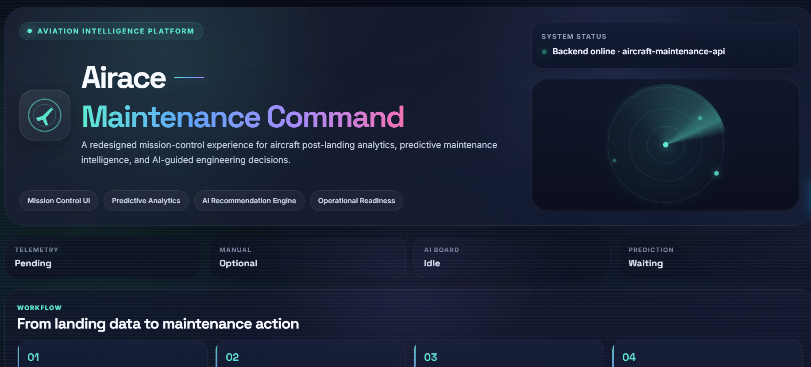
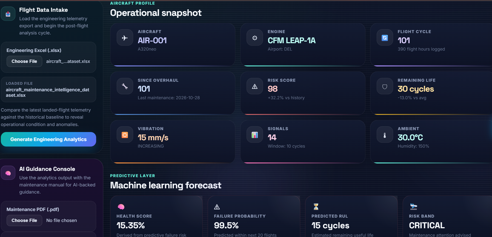
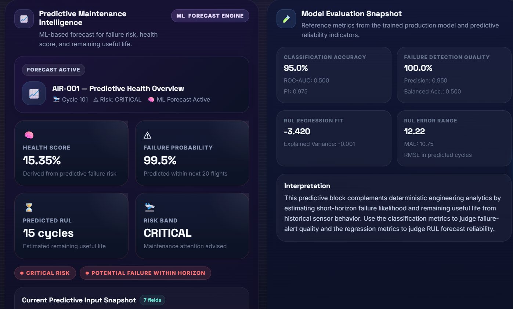
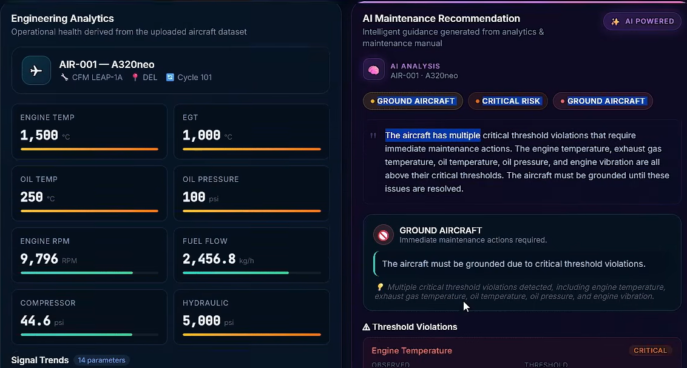

# ✈️ Airace Maintenance Command

<p align="center">
  <b>An AI-powered aviation intelligence platform for post-landing engineering analytics, predictive maintenance, and maintenance decision support.</b>
</p>

<p align="center">
  
  
  
  
  
</p>

---

## Overview

**Airace Maintenance Command** is an aviation-focused intelligent maintenance platform that transforms raw aircraft telemetry into actionable engineering insights.

It combines:

- **engineering analytics** from uploaded aircraft datasets,
- **predictive maintenance models** for failure risk and remaining useful life,
- and **AI-generated maintenance guidance** grounded in operational context and maintenance manuals.

The platform is designed to simulate how modern airlines and MRO ecosystems can move from **reactive maintenance** to **predictive, data-driven decision-making**.

---

## Why this project matters

Aircraft maintenance is one of the most critical functions in aviation operations. Delayed issue detection, fragmented diagnostics, and slow decision-making can lead to:

- operational delays,
- higher maintenance costs,
- reduced fleet availability,
- and increased safety risk.

This project addresses that by building a system that can:

- interpret engineering telemetry after landing,
- identify abnormal behavior and degraded health,
- estimate short-horizon failure risk,
- forecast remaining useful life,
- and produce structured maintenance recommendations.

In short, **Airace helps convert telemetry into maintenance intelligence.**

---

## Product Preview

### 1. Mission Control Landing Page
A redesigned command-center UI for aviation intelligence and post-landing operational review.



---

### 2. Engineering Analytics + Operational Snapshot
Flight data intake and aircraft profile cards showing key telemetry-derived health indicators.



---

### 3. Predictive Maintenance Intelligence
Forecast engine showing health score, failure probability, risk band, and predicted RUL.



---

### 4. AI Maintenance Recommendation Board
AI-assisted maintenance reasoning with grounding, threshold violations, and decision support.



---

## Key Features

### Engineering Analytics
- Upload aircraft telemetry data from Excel files
- Derive operational metrics from current and historical flight records
- Display health indicators such as:
  - engine temperature,
  - exhaust gas temperature,
  - oil pressure,
  - vibration,
  - fuel flow,
  - hydraulic pressure,
  - risk score,
  - remaining useful life

### Predictive Maintenance
- Predict **failure probability within the next N flights**
- Estimate **remaining useful life (RUL)**
- Compute **engine health score**
- Categorize aircraft into operational **risk bands**
- Show predictive input snapshots and model evaluation metrics

### AI-Powered Maintenance Guidance
- Generate maintenance recommendations from engineering analytics
- Highlight threshold violations
- Perform root-cause style diagnostic summarization
- Produce prioritized maintenance actions
- Generate inspection checklists
- Create work-order style outputs for operational clarity

### Modern Full-Stack Deployment
- Frontend built with **React**
- Backend powered by **FastAPI**
- Model training and inference in **Python / scikit-learn / XGBoost**
- Containerized with **Docker**
- Deployed using **AWS ECR + EKS**
- CI/CD automated via **GitHub Actions**

---

## System Architecture

```text
                   ┌─────────────────────────────┐
                   │   Aircraft Telemetry File   │
                   │        (.xlsx upload)       │
                   └──────────────┬──────────────┘
                                  │
                                  ▼
                    ┌──────────────────────────┐
                    │       React Frontend      │
                    │  Airace Maintenance UI    │
                    └──────────────┬───────────┘
                                   │ API calls
                                   ▼
                    ┌──────────────────────────┐
                    │      FastAPI Backend      │
                    │  Engineering + AI APIs    │
                    └──────────────┬───────────┘
                                   │
               ┌───────────────────┼────────────────────┐
               │                   │                    │
               ▼                   ▼                    ▼
   ┌──────────────────┐  ┌────────────────────┐  ┌──────────────────────┐
   │ Engineering      │  │ Predictive ML      │  │ AI Recommendation    │
   │ Analytics Engine │  │ Inference Module   │  │ + Manual Grounding   │
   └──────────────────┘  └────────────────────┘  └──────────────────────┘
                                   │
                                   ▼
                    ┌──────────────────────────┐
                    │ Dashboard + Decision UI  │
                    └──────────────────────────┘
